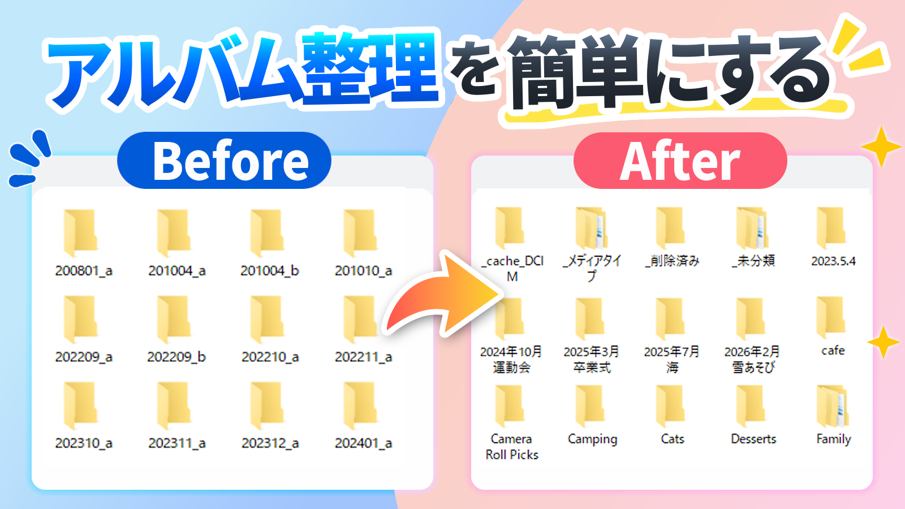

# XYZETON アルバムバックアップ（Windows用）

iPhoneの写真を、アルバム構造のままWindowsへ保存するツールです。



左は、エクスプローラーでiPhoneを開いたところ。写真は撮影年月のフォルダにしか分かれていません。
右が、このツールで書き出したところです。iPhoneのアルバムがそのままフォルダになります。
どのアルバムにも入っていない写真は `_未分類`、ビデオやスクリーンショットは `_メディアタイプ` に入ります。

iPhoneの写真アプリで作った「フォルダ」「アルバム」の分け方を**そのまま**、パソコンのフォルダとして保存します。

- Windowsの「フォト」でよく起きる**フリーズ**や**「デバイスに到達できません」**が起きません（同じ仕組みを使っていないため）
- iPhoneの「202608_a」のような**日付フォルダにまとめられて、どこに何があるかわからない**問題を解決します
- ファイル名の先頭に撮影日時が付くので、**名前順に並べると撮影順**になります
- 途中で止まっても、もう一度実行すれば**続きから再開**します

```
完成イメージ
E:\iPhoneAlbums\
 ├─ 家族\
 │   └─ 運動会\      20240105_120000_IMG_0003.HEIC, 20240105_120000_IMG_0003.MOV ...
 ├─ 旅行2025\        20240106_103000_IMG_0001.HEIC ...
 ├─ _メディアタイプ\  iPhoneの「メディアタイプ」と同じ分類（ビデオ／セルフィー／Live Photos／…）を 年\年-月 で
 │                    ※アルバムに入れていない子どもの動画なども、ここの「ビデオ」から探せます
 ├─ _未分類\         どのアルバムにも入れていない写真（年\年-月 で整理）
 ├─ _削除済み\       （任意）iPhoneで消した/外した写真の退避先
 ├─ _album_state.json  アルバム名変更の追従に使う記録（消さないでください）
 └─ _cache_DCIM\     写真の実体（消さないでください ※よくある質問参照）
```

> **動作確認済み**: iPhone 11 Pro Max / iOS 26.6.1 / Windows 10・Windows 11 /
> **Apple純正USBケーブル** / 写真・動画 84,000点（207GB）
> これ以外の環境は未確認です。iOSのアップデートで動かなくなる可能性があります（無保証・自己責任）。

---

> ## 📍 このREADMEは2種類の人向けです
>
> - **① 自分でビルドする人（開発者・XYZETONさん）**
>   → `build.bat` をダブルクリックして `XYZETONAlbumBackup.exe` を作る。
>     手順は下の「■ 開発者向け：exeのビルド」へ。
>     まだ `XYZETONAlbumBackup.exe` は存在しないので、「使い方（exe版）」を今すぐ読んでも実行できません。
>
> - **② 完成したzipを受け取った人（配布・購入した人）**
>   → 下の「■ 使い方（exe版・おすすめ）」からどうぞ。`XYZETONAlbumBackup.exe` が既にzipの中に入っています。

---

## ■ 開発者向け：exeのビルド（配布物を作る）

1. `build.bat` をダブルクリック（Python 3.12 が必要。3〜5分かかります）
2. 完了すると `dist` フォルダができます。**注目するのはここだけ**です。

```
dist\
 ├─ XYZETONAlbumBackup\              アプリ本体のフォルダ
 │   ├─ XYZETONAlbumBackup.exe       ★ 動作確認はこれを実行
 │   ├─ _internal\                  必要な部品（触らない）
 │   └─ album_export.py / LICENSE / README など（GPLのためソースも同梱）
 ├─ XYZETONAlbumBackup_vX.X.X.zip    ★ これをBOOTH / GitHub Releases にアップロード
 └─ SHA256.txt                      ★ この中身をダウンロードの横に掲載
```

ビルドすると他にもフォルダが増えますが、**すべて作業用のゴミなので消して構いません**
（消してもビルドし直せば再生成されます。GitHubには上げないでください）。

| 増えるもの | 中身 | 消してよいか |
|---|---|---|
| `dist` | 成果物 | **消さない** |
| `build` | PyInstallerの中間ファイル | 消してよい |
| `.venv` | ビルド専用のPython環境（毎回作り直し） | 消してよい |
| `__pycache__` / `.pytest_cache` | Python・テストのキャッシュ | 消してよい |
| `XYZETONAlbumBackup.spec` | PyInstallerの自動生成設定 | 消してよい |
3. **まずここで自分のiPhoneを繋いで動作確認**（1→2→3 のボタンを一通り）
4. 問題なければ `dist\XYZETONAlbumBackup` フォルダを **zip に圧縮**したものが配布物です
   （中の `XYZETONAlbumBackup.exe` をダブルクリックして動くか、別PCでも確認推奨）
5. そのzipをBOOTH等にアップロード → 以降は下記「■ 使い方（exe版）」が購入者向けの説明になります

---

## ■ 使い方（exe版・おすすめ）

### 用意するもの
- Windows 10/11 のパソコン
- **空き容量**: 下の「必要な容量」を必ず確認してください
- **Apple純正のUSBケーブル**（動作確認は純正のみで行っています）
  > ⚠ 非純正ケーブルは**動作保証の対象外**です。すべてを検証できないためで、
  > 実際、エクスプローラーではiPhoneの中身が見えるのに本ツールでは接続できない例がありました
  > （エクスプローラーとは通信の仕組みが違うため、見えていても接続できるとは限りません）。
  > うまくいかない場合は、まず**純正ケーブルでお試しください**。充電専用ケーブルは論外です。

### 必要な容量

**保存先とキャッシュが同じドライブ（NTFS）にある場合**
必要なのは **iPhoneの写真・動画の合計＋少し** です。
アルバムや種類別フォルダの中身は実体のコピーではなく「ハードリンク」（同じファイルを指す別名）なので、
いくつのフォルダに現れても**ディスクの容量は増えません**。
> 実測例: 写真の実体167GB / ファイル数255,205 → **ディスクの実消費は約167GB**

> ⚠ **エクスプローラーのフォルダサイズは、実際よりずっと大きく表示されます。**
> エクスプローラーはハードリンクを1件ずつ数えるため、1枚の写真が
> 「キャッシュ・アルバム・種類別フォルダ」の3か所に現れると3回ぶん加算されます。
> 実測例: 実体167GBのバックアップが、フォルダのプロパティでは **540GB** と表示されました（3.2倍）。
> **ディスクは減っていません。** 本当の使用量はドライブのプロパティ（使用領域）で確認してください。
>
> 確かめたい場合は、PowerShellで次を実行すると、同じ実体を指すパスが並びます（複数出れば正常）。
> ```
> fsutil hardlink list "E:\\iPhoneAlbums\\<アルバム名>\\<ファイル名>"
> ```

**保存先がNTFS以外（exFAT / FAT32 の外付けドライブなど）、または保存先とキャッシュが別ドライブの場合**
ハードリンクが使えないため、**同じ写真がフォルダの数だけ実体コピーされます**。
この場合は本当に **写真の合計の3倍前後**（207GBなら600GB以上）が必要です。
アプリは開始時にハードリンクが使えるか検査し、使えない場合は
`⚠ この保存先ではハードリンクが使えません` と表示します。
この警告が出たら、**保存先を NTFS のドライブに変える**のが最善です。

外付けドライブを使う場合は、フォーマットが **NTFS** か確認してください
（ドライブを右クリック → プロパティ → 「ファイルシステム」）。exFAT ではハードリンクが使えません。

### 1. Apple の接続ソフトを入れる（最初の1回だけ）
このツールは **iTunes と同じ仕組み**でiPhoneと通信します。その通信を担う
**Apple Mobile Device Service** というWindowsのサービスが必要なので、次のどちらかを入れてください。

- **Windows 11**: Microsoft Store の **「Appleデバイス」** アプリ（推奨）
- **Windows 10**: Apple公式サイトの **iTunes**

入れたら**一度起動して、iPhoneが認識されることを確認**してください。確認できたら閉じてOKです。

> ⚠ **iTunes と「Appleデバイス」を両方入れると競合することがあります。** どちらか片方にしてください。
> 入れ替えた場合は **PCを再起動**してから使ってください。

### 2. ダウンロードして展開（インストール作業はありません）
このソフトはインストール不要です。**zipを展開して、中のexeを実行するだけ**です。

1. ダウンロードした zip を**右クリック →「すべて展開」**
   > ⚠ **zipを開いた中のexeを直接ダブルクリックしないでください。**
   > 一時フォルダで動いてしまい、次回起動時にアルバム情報（数GB）を取り直すことになります。必ず先に展開してください。
2. 展開してできた **`XYZETONAlbumBackup`** フォルダを、置いておきたい場所へ移動します

**置き場所の選び方**
- おすすめ: `D:\XYZETONAlbumBackup` や `C:\Users\<自分の名前>\XYZETONAlbumBackup` など、**自分で自由に書き込める場所**
- このフォルダの中に、iPhoneのアルバム情報（**数GB**。iPhone 11 Pro Max・8万枚で約7GB）が保存されます。**その分の空き容量があるドライブ**に置いてください
- 「ダウンロード」フォルダのままでも動きますが、後で掃除した時に一緒に消えて、次回また数GBの取得が必要になります
- `C:\Program Files` に置いても動きます（書き込めない場合は自動でユーザー領域に保存先を切り替えます）が、おすすめしません
- フォルダごと別のドライブへ移動しても、そのまま使えます

3. フォルダの中の **`XYZETONAlbumBackup.exe`** をダブルクリック（よく使うならショートカットをデスクトップに作ると便利です）

> **「WindowsによってPCが保護されました」と出たら**
> 個人開発のソフトに必ず出る警告です（有料の証明書を買わないと消えません）。
> 青い画面の **「詳細情報」** をクリック → **「実行」** を押してください。

> **「スマート アプリ コントロールがブロックしました」と出たら**
> 上の警告とは別の機能で、こちらは「詳細情報 → 実行」のような逃げ道がありません。
> 対処は2つあります。詳しくは下のよくある質問をご覧ください。
> 手っ取り早いのは、exeを使わず `source` フォルダから直接動かす方法です。

### 3. iPhone をつなぐ
USBでつなぐ → iPhoneのロックを解除 → 「このコンピュータを信頼しますか？」で **「信頼」** をタップ。
**作業中はiPhoneをロックせず、つないだままにしてください。**

### 3.5 言語（Language）
右上の **日本語 / English** で切り替えられます（次回起動時も記憶されます）。
※ 言語を切り替えると `_未分類`→`_Unsorted`、`_メディアタイプ\ビデオ`→`_MediaTypes\Videos` のように
特殊フォルダの名前も切り替わり、既存のバックアップは次回実行時に自動でリネームされます（写真は増えません）。
英語の説明書は `README_en.md`。

### 4. 画面の 1 → 2 → 3 を順番に押す
画面はこう構成されています。
- **iPhone カード**: 接続すると端末名・iOS・写真の件数・容量が入ります
- **1 / 2 / 3**: 今やるべきものが濃い色。済んだものも押せる（**再実行できます**）
- **進捗**: 実行中は「◯◯/◯◯ 件・◯◯/◯◯ GB・◯%・経過・残り」を表示
- **バックアップ設定**: ふだんは畳んであります。既定のままで問題ありません。
  変更した内容は**次回起動時も保たれます**（「写真のダウンロードは飛ばし…」だけは
  毎回オフに戻ります。入ったままだと写真を取得していないのにバックアップしたつもりに
  なってしまうためです）
- **詳細ログ**: ふだんは畳んであります。**エラーや警告が出ると自動で開きます**

確認のウィンドウ（「開始しますか？」など）は、**必ずアプリの中央**に出ます。
モニタが複数あっても別の画面へ飛ぶことはありません。

画面が縦に長くなった場合は、**マウスホイールで画面全体をスクロール**できます
（設定とログを両方開いても、下まで届きます）。
1. **1 接続を確認** … 1分。「✅ 接続できました」「✅ アルバム情報を読めます」と出ればOK
2. **2 アルバムを確認** … 初回はアルバム情報（数GB）を取るため10〜20分。自分のアルバムが並べばOK
3. **保存先** を「フォルダを選ぶ」で選び、**3 バックアップを始める**
   - 数時間かかります。**PCがスリープしない設定**にしてください（設定 → システム → 電源とスリープ → スリープ「なし」）
   - 終わると音が鳴り、保存先フォルダが自動で開きます

### 途中でやめたい／電話がかかってきた
実行中は「3」のボタンが **「■ 中止」** に変わります。押すと今のファイルの区切りで止まり、取得済みはそのまま残ります。
再開は **3 をもう一度**。ダウンロード済みの写真は飛ばして続きから再開します。

### ケーブルが抜けた／接続が切れた
ダウンロード中に切れると「接続が切れました」のウィンドウが出て、**最大10分待ちます**。
つなぎ直すと自動で再接続し、同じファイルの続きから再開します（ウィンドウは自動で閉じます）。
10分過ぎた場合や、PCが落ちた場合も、3 をもう一度押せば続きから再開できます。
アルバム情報（数GBの1ファイル）の取得中に中止・切断しても、次回はその続きから取ります。

ログに「📱 iPhoneとの通信は終わりました」と出た後は、ケーブルを外しても大丈夫です（残りはPC内の処理）。

---

## よくある質問

**Q. 同じ写真がアルバムと `_メディアタイプ` の両方に入っている。容量は2倍？**
A. なりません。どちらも同じ実体を指す「ハードリンク」で、iPhoneの表示（アルバムにもメディアタイプにも出る）と同じ構造です。
   1つの写真は種類のうち **1つだけ** に入ります（例: Live Photoのセルフィーは「Live Photos」）。

**Q. メディアタイプの件数がiPhoneと合わない**
A. 種類の判定に使っている内部コードがiOSの版で違う可能性があります。保存先の `_メディアタイプ診断.txt` を共有してください。

**Q. アプリのフォルダに `_photos_db` ができて数GBある。消していい？**
A. iPhoneのアルバム情報です。消しても動きますが、次回また取得に10〜20分かかります。容量が惜しくなければ残しておくのがおすすめです。

**Q. `_cache_DCIM` フォルダは消していい？**
A. **消さないでください。** アルバムのフォルダ内の写真はこの実体を指す「ハードリンク」です。容量は2倍になっていません。
   どうしても消す場合は、アルバムフォルダを別の場所へコピーしてから。

**Q. ファイル名の先頭の数字は？**
A. `20240105_120000_` ＝ 2024年1月5日 12:00:00 の撮影日時。iPhoneの連番（IMG_9999の次がIMG_0001）だと名前順が
   撮影順にならないため付けています。不要なら画面のチェックを外してください。

**Q. 「iCloudにしか無い写真: ○個」と出た／`_iCloudにしか無い写真.txt` ができた**
A. iPhoneの「iPhoneのストレージを最適化」がONで、写真の本物がiCloudにしかない状態です。
   ツールは先にこれを検出して、どの写真がどのアルバムのものか一覧を書き出します（取得できた分は普通にバックアップされます）。
   iPhoneの 設定 → 写真 → **「オリジナルをダウンロード」** に変えて、Wi-Fiで一晩置いてから、
   「写真のダウンロードは飛ばし…」の**チェックを外して** 3 をもう一度。

**Q. `💾 保存先が見えなくなりました` と出て待機する**
A. 保存先のドライブ（特に外付けHDD）が転送中に切断されています。接続を確認してください。
   戻れば自動で続きから再開します（最大30分待ちます）。
   **予防策**: Windowsの電源プランで「ハードディスクの電源を切る」を「なし」にしてください
   （設定 → システム → 電源 → 電源モードの詳細設定 → ハードディスク）。
   USB接続のドライブなら、デバイスマネージャーで USB Root Hub のプロパティ →
   電源の管理 →「電力の節約のために…電源をオフにできるようにする」のチェックも外します。

**Q. `[Errno 13] 保存先に書き込めません` で止まる**
A. ほとんどの場合、**ウイルス対策ソフトが書き込み中のファイルを掴んでいる**のが原因です
   （空き容量は関係ありません）。一時的なものは自動で待って再試行しますが、
   頻発する場合は保存先フォルダを Windows セキュリティの「除外」に追加してください。
   設定 → プライバシーとセキュリティ → Windowsセキュリティ → ウイルスと脅威の防止 →
   設定の管理 → 除外の追加または削除。
   保存先ドライブの「内容にインデックスを付ける」をオフにするのも効果があります。
   取得済みのファイルは残っているので、対処後にもう一度実行すれば続きから再開します。

**Q. `_取得失敗一覧.txt` ができた**
A. USBの一時的な不調などで取得できなかったファイルの一覧です。もう一度 3 を実行すると、その分だけ再試行されます。
   全体は止まらず、取得できたものは保存済みです。

**Q. 「スマート アプリ コントロールが安全でない可能性のあるアプリをブロックしました」と出る**

Windows 11 をクリーンインストールした環境などで有効になっている機能です。
発行元の署名が無いアプリを、問答無用でブロックします。
「WindowsによってPCが保護されました」の警告とは別物で、
**「詳細情報 → 実行」のような逃げ道はありません。**
個別のアプリだけ許可する設定もありません。

本ツールは署名を取得していないため、この機能がオンのPCでは exe が起動できません。
対処は2つです。

**1. exeを使わず、ソースから動かす（おすすめ）**

zipの中の `source` フォルダに、ソースコード一式が入っています。
Python 3.12 があれば、そのフォルダで次を実行すれば同じものが動きます。

```
py -3.12 -m pip install pymobiledevice3==11.3.1 customtkinter==6.0.0
py -3.12 gui.py
```

exeを経由しないので、ブロックされません。

**2. スマート アプリ コントロールをオフにする**

設定 → プライバシーとセキュリティ → Windows セキュリティ →
アプリとブラウザーの制御 → スマート アプリ コントロールの設定 → オフ

最近の Windows なら後からオンに戻せますが、環境によっては戻せないことがあります。
セキュリティ機能を切る操作なので、判断はご自身でお願いします。

**Q. タイトルバーに「(応答なし)」と出る／画面が固まったように見える**

写真の一覧を調べている間など、iPhoneへの問い合わせが集中する場面で表示されます。
**処理は止まっていません。** 画面の更新が止まるだけで、裏では進んでいます。

**写真が多いと、この状態が長く続きます。**
8万枚・167GB の環境では、**最長で約9分**表示が固まったままになりました。
工程が変わると表示も元に戻ります。

強制終了せず、そのままお待ちください。
万一終了してしまっても、取得済みのファイルは残り、次回は続きから再開します。

**Q. 非純正のケーブルでも使えますか**
A. 動くものもありますが、**動作保証の対象外**です（すべてのケーブルを検証できないため）。
   実際に、エクスプローラーではiPhoneの中身が見えるのに本ツールでは接続できず、
   **純正ケーブルに替えたら接続できた**という例がありました。
   接続できない場合は、まず純正ケーブルでお試しください。

**Q. エクスプローラーではiPhoneの中身が見えるのに「接続できませんでした」と出る**
A. **ケーブルの問題ではありません。** エクスプローラーが使う仕組み（MTP）と、このツールが使う仕組み
   （iTunesと同じもの）は別物で、片方だけ動いていない状態です。原因はほぼ
   **Apple Mobile Device Service が動いていない**ことです。
   1. Windowsキー+R →『services.msc』→ **Apple Mobile Device Service** を右クリック →「開始」
      （スタートアップの種類は「自動」に）
   2. 一覧に無ければ、Microsoft Storeの**「Appleデバイス」**アプリを入れて一度起動する
   3. iTunes と「Appleデバイス」を両方入れていると競合します。片方にして**PCを再起動**
   ※ ツールのエラーメッセージにも、状況に応じてこの手順が表示されます。

**Q. 写真が .HEIC で開けない**
A. iPhone標準の形式です。Microsoft Store で「HEIF 画像拡張機能」を入れると見られます。

**Q. 2回目以降は？（iPhoneで写真を追加・アルバム名を変更した後）**
A. 「アルバム情報を取り直す」にチェックして 3。挙動は次の通りです。
   - 追加した写真 → 新しい分だけダウンロードして追加
   - アルバム名の変更・フォルダ間の移動 → PC側のフォルダも同じ名前・場所に追従（重複フォルダは作りません）
   - iPhoneで消した写真・アルバムから外した写真 → **既定では何もしません**（バックアップは消さない主義）。
     PC側も揃えたい時は「…『_削除済み』へ移す」にチェック。削除ではなく移動なので後から戻せます。
   ※ 追従には保存先の `_album_state.json` を使います。消さないでください。

**Q. 「アルバム情報にUSB経由で届きません」と出た**
A. そのiOSバージョンでは未対応です。GitHubのIssueに「iOSバージョン・Windowsバージョン・画面のログ」を貼ってください。

---

## ■ 上級者向け（Python版）
exeを使わず、ソースを直接動かす場合：
```
py -3.12 -m pip install pymobiledevice3 customtkinter
py -3.12 probe.py                              # 接続チェック
py -3.12 album_export.py --list                # アルバム一覧
py -3.12 album_export.py --out E:\iPhoneAlbums # 本番
py -3.12 gui.py                                # GUI版
```
※ Python 3.13以降は依存ライブラリのWindows用バイナリが無いため **3.12** を使ってください。
オプション一覧は `py -3.12 album_export.py --help`。

## お問い合わせ時の注意

「ログをコピー」で得られる内容には、端末名・アルバム名・ファイル名・保存先パスなど、
**個人情報が含まれることがあります**。Issue等で共有する際は、公開しても問題ない内容か
事前にご確認ください。

## 対応範囲・確認方法

- **対応範囲と既知の制限**: `docs/compatibility.md`
  （確認済み／対象外／**未確認**を分けて記載しています。共有アルバムや編集後の写真は未確認です）
- **取得結果の確認方法**: `docs/verification.md`
  （欠落していないことの確認手順。バックアップでは実行できたことより重要です）

> ⚠ ハードリンクは独立したコピーではありません。同じファイルの実体を共有するため、
> ある経路から内容を変更すると他の経路にも反映されます。
> また、**このドライブが壊れれば全部失われます**。重要な写真は別の場所にもコピーを持ってください。

## 誰が作ったか

| 担当 | 内容 |
|---|---|
| XYZETON（作者） | 企画、画面設計、実機での検証、不具合の発見、追加要望、公開の準備 |
| Anthropic Claude | プログラムの実装すべて（DB解析、通信、例外処理、テスト、ビルド） |

作者はグラフィックデザイナーで、プログラミングは専門ではありません。

そのため、**使い方・動作・不具合の報告には対応できますが、
コードの詳細な設計意図についてはお答えできない場合があります。**
不具合のご報告は、iOSのバージョン・Windowsのバージョン・使用ケーブル（純正か否か）と、
アプリの「ログをコピー」で取得したログを添えていただけると調査しやすいです。

## 開発支援について

本体は無料です。任意の開発支援の窓口を用意していますが、
**支援によって内容が変わることはありません**（個別対応・動作保証・特別なビルドは付きません）。
窓口の場所は変わる可能性があるため、最新の案内はこのREADMEに記載します。

［支援窓口URL］

## 同梱しているソースコード

GPL-3.0 のため、ソースコード一式を zip の `source` フォルダに同梱しています。

```
source\
├ album_export.py  gui.py  probe.py  conftest.py  build.bat
└ tests\           （リグレッションテスト）
```

exeが使えない環境では、ここから直接実行できます（上のよくある質問を参照）。

## 通信について

このツール自身のコードが接続するのは、PC内のAppleのサービス（`127.0.0.1:27015`、Apple Mobile Device Service）だけです。
写真・アルバム名・ログをインターネットへ送る処理はありません。
※ 利用しているライブラリを含め、ネットを切った状態で最後まで動くかは現在確認中です。

## 作者・ライセンス
作者: **XYZETON**（X: @xyzeton ← 公開時に実アカウントへ）
GPL-3.0-or-later（LICENSE 参照）。利用ライブラリの表記は THIRD_PARTY_NOTICES.md。
企画・画面設計・実機検証は作者が、プログラムの実装は Anthropic Claude が担当しました（「誰が作ったか」参照）。

本ツールは Apple Inc. とは無関係の個人開発ソフトウェアです。iPhone は Apple Inc. の商標です。

## 仕組み（興味のある人向け）
iPhoneのアルバムは「フォルダ」ではなく、写真アプリ内部のデータベース（Photos.sqlite）の分類タグです。
本ツールはこのDBをUSB（AFC）経由で取得して「アルバム → 写真」の対応表と撮影日時を読み取り、
写真の実体（DCIM）をダウンロードした後、対応表どおりにハードリンクで振り分けます。
Windowsフォトが使うMTPではなく、iTunesと同じ通信層を使うためフリーズしません。
